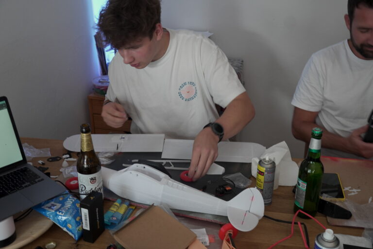
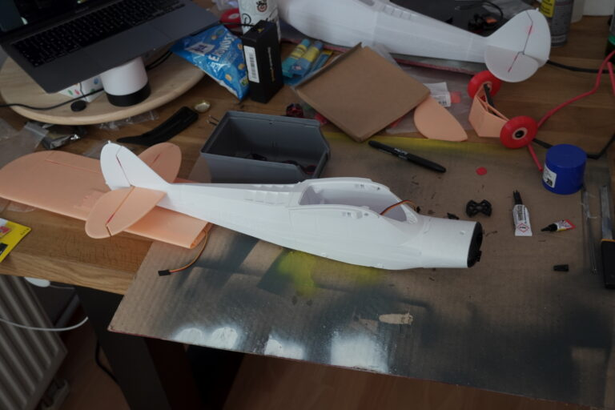
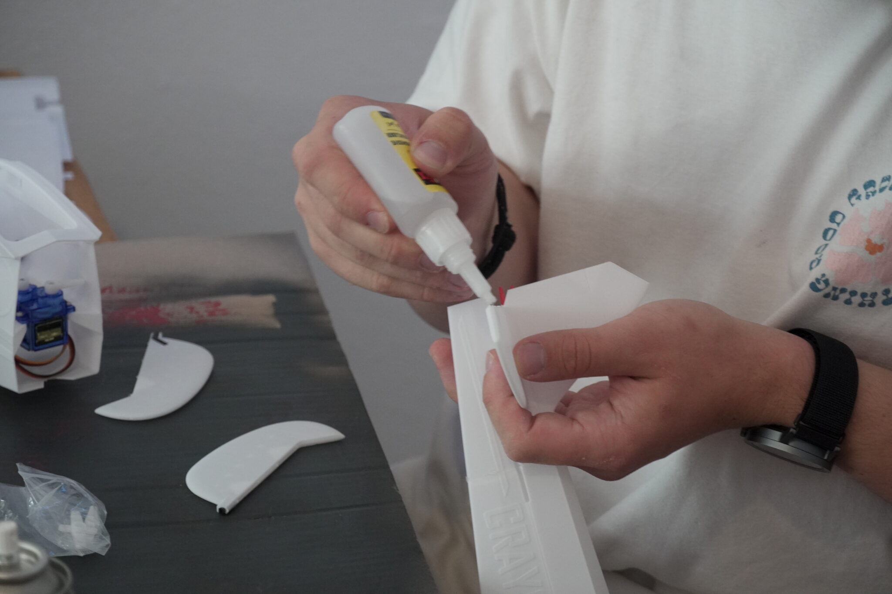
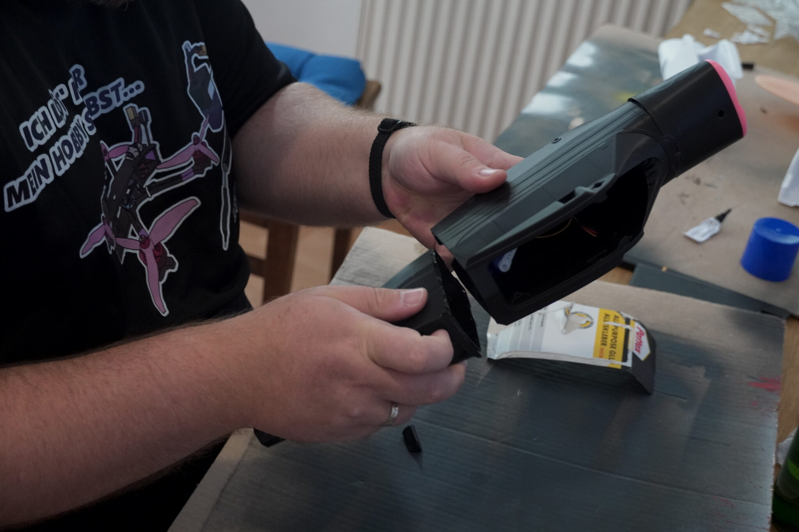
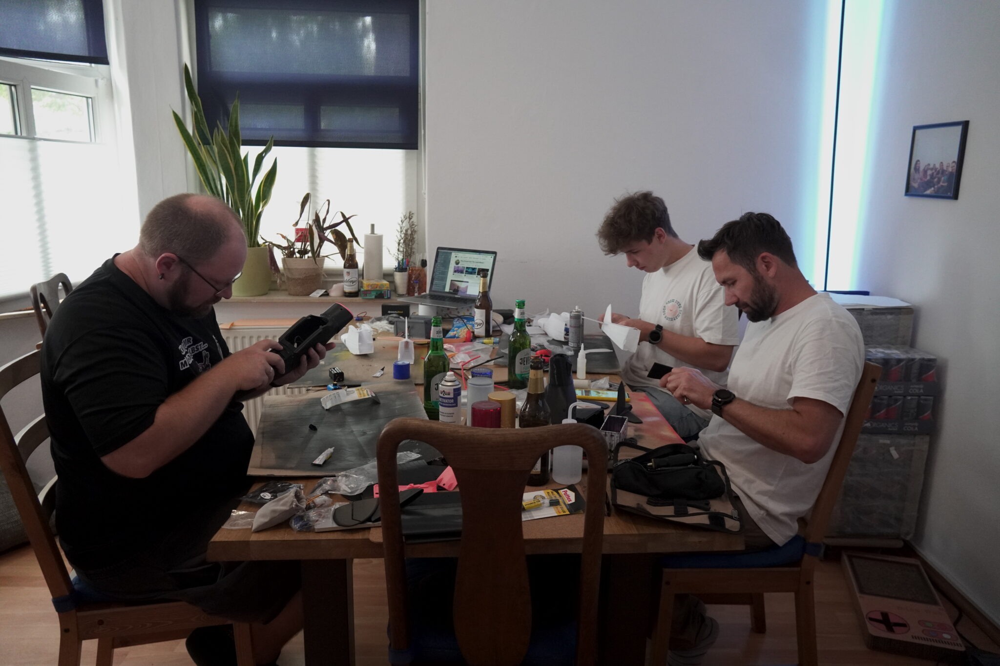

Letzten Sonntag haben sich einige Communitymitglieder aus Jena zum gemeinsamen Bau-Tag getroffen und jeder hat seinen eigenen 3D-gedruckten RC-Flieger zusammengesetzt. Die Einzelteile kamen frisch aus dem Drucker, wurden Stück für Stück mit Sekundenkleber und Aktivator verbunden und anschließend wurden Kleinteile und Elektronik eingesetzt.

Am Ende entstanden vier Modelle vom Typ Craycle Cub V2

Ein paar Eindrücke vom Basteln findet ihr in der Galerie – demnächst folgt natürlich der Maiden Flight!

