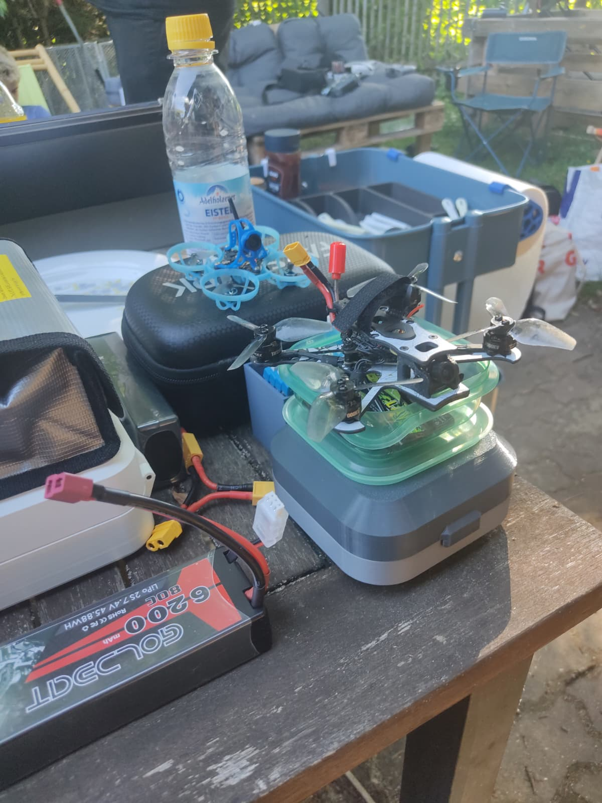
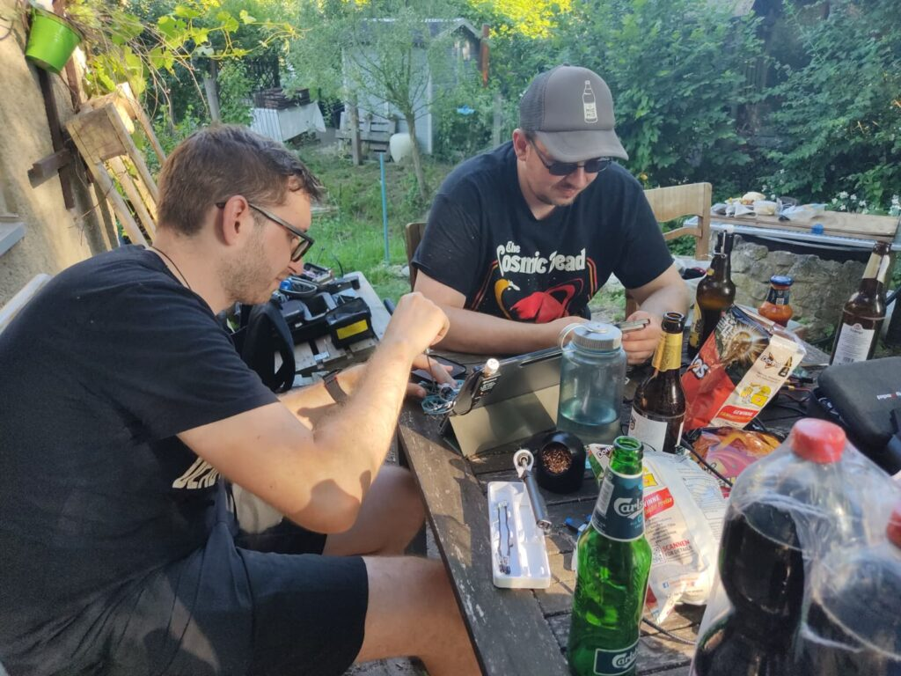
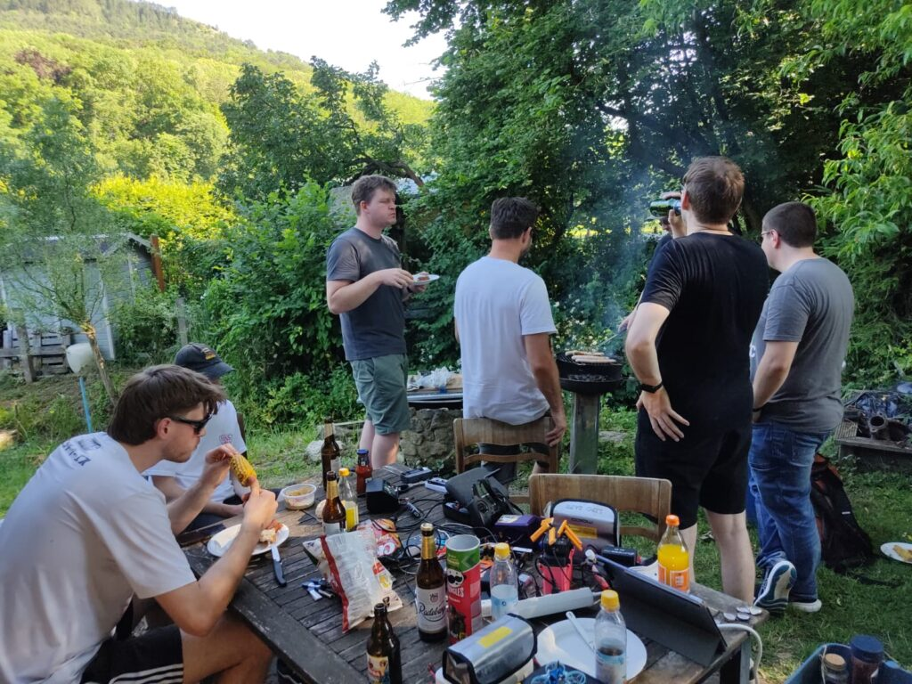

Was gibt es Besseres als Sommer, Sonne und jede Menge Propeller-Sound? Letzten Samstag haben wir das gute Wetter ausgenutzt und Johannes’ Garten unsicher gemacht!

Neben glühenden Grillkohlen und reichlich Hitze stand vor allem ein extrem kreativer Freestyle-Track auf dem Programm. Johannes hat aus dem Garten in einen echtes Whoop Paradies verzaubert: Leitern, Stühle und als absolutes Highlight ein alter Fahrradmantel, der mitten im Baum als perfektes Gate hing!

Die engen Gaps und die Hitze haben uns einiges abverlangt, aber der Spaßfaktor war riesig. Ein perfekter FPV-Samstag!

Zwischendurch musste auch mal repariert werden, bevor es zurück in die Luft ging.

Und natürlich durfte auch der Grill nicht fehlen!

Ein riesiges Danke an Johannes für die Gastfreundschaft und den genialen Parcours!

  <iframe
    src="https://www.youtube.com/embed/3X3c2K9Xbo0"
    title="YouTube video player"
    style="position: absolute; inset: 0; width: 100%; height: 100%; border: 0;"
    allow="accelerometer; autoplay; clipboard-write; encrypted-media; gyroscope; picture-in-picture; web-share"
    referrerpolicy="strict-origin-when-cross-origin"
    allowfullscreen
  ></iframe>

 